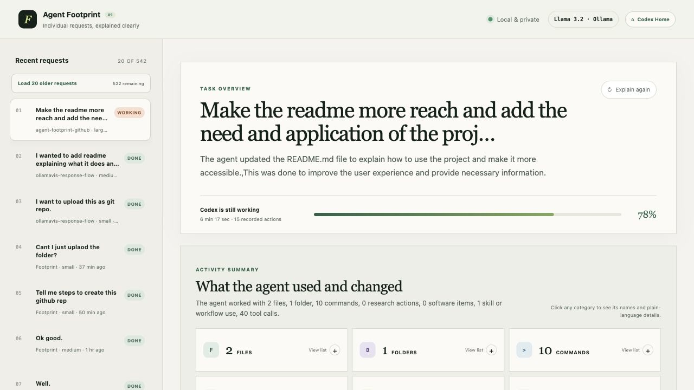
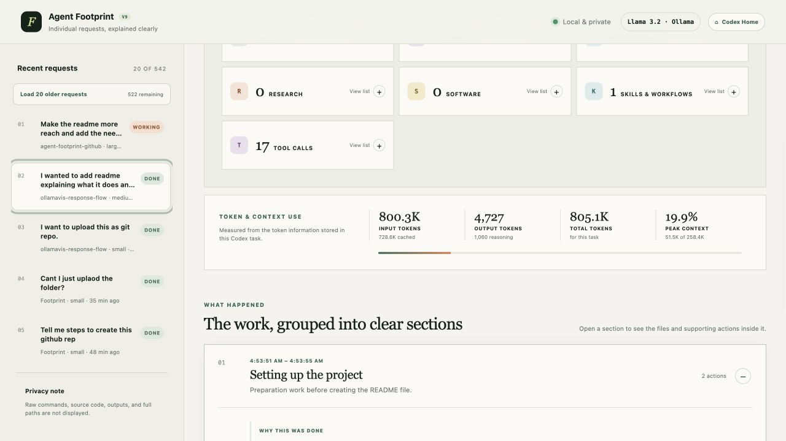
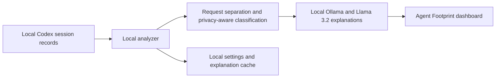

# Agent Footprint

**A private, local dashboard that turns Codex activity into a clear, human-readable record of what happened, why it happened, and what changed.**

Agent Footprint reads local Codex session records, separates a conversation into individual user requests, and explains the files, commands, research, tools, Skills, token use, and outcomes connected to each request. Version 9 uses `llama3.2:latest` through a local Ollama service, so task records are not sent to a hosted Llama service.



The dashboard also connects activity categories with token usage and a chronological, plain-language explanation of the work:



## Why Agent Footprint is needed

AI coding agents can complete a large amount of work quickly, but their activity is often spread across chat messages, terminal calls, file edits, research steps, and tool output. That makes simple questions surprisingly difficult to answer:

- What did the agent actually do for this request?
- Which files or folders were involved?
- Were tests or builds run?
- Did the task use online research or specialized tools?
- How much token context did the task consume?
- Is the agent still working, and what has it completed so far?

Agent Footprint provides a local audit and understanding layer for that activity. It does not replace Codex or monitor network packets. It converts the activity already recorded in local Codex sessions into a concise, privacy-aware dashboard that both technical and non-technical users can understand.

## Where it can be applied

| Application | How Agent Footprint helps |
| --- | --- |
| Personal development | Review what Codex changed without rereading a long conversation or raw terminal output. |
| Project handoff | Give a teammate a plain-language summary of completed work, checks, and outcomes. |
| Debugging and review | Identify the files, command categories, research, and tools involved in a problematic request. |
| Learning and mentoring | See the sequence of work an agent followed and understand why each group of actions was useful. |
| Usage awareness | Compare token totals and peak context use across requests when Codex recorded those metrics. |
| Privacy-conscious auditing | Inspect local agent activity while hiding raw commands, source code, full paths, and sensitive command details from the dashboard. |
| Workflow evaluation | Observe which Skills and tools are used most often and where automation is helping or creating friction. |

## What the dashboard shows

- A separate entry for every user request, including follow-ups in the same Codex conversation.
- A plain-language task overview, status, duration, recorded action count, and estimated live progress.
- Work grouped into understandable sections with the reason, outcome, and supporting actions for each section.
- Activity categories for files, folders, commands, research, software, Skills, and tool calls.
- Repeated commands and tool calls grouped with occurrence counts.
- Friendly file-type names, such as “Modular JavaScript source code file” for `.mjs`.
- Sanitized, clickable public links when recorded online research contains a usable URL.
- Input, cached input, output, reasoning, total-token, and peak-context metrics when available.
- The newest 20 requests first, with older requests loaded in groups of 20.
- A configurable Codex Home directory with local validation and Finder integration.

See [EXAMPLES.md](EXAMPLES.md) for representative behavior.

## How it works



1. The analyzer reads session files from the selected local Codex Home.
2. Session events are separated at each user request, so follow-ups become their own dashboard entries.
3. Local rules classify known activity and remove sensitive details from unfamiliar commands.
4. Sanitized activity is explained in ordinary language by Llama 3.2 running through Ollama on the same computer.
5. The browser dashboard displays the result and refreshes active tasks as new activity is recorded.

## Requirements

The one-click launcher is designed for macOS. You need:

- Codex with local session records
- [Node.js](https://nodejs.org/) 22.13 or newer
- npm
- [Ollama](https://ollama.com/)
- The Ollama `llama3.2` model; the launcher downloads it when necessary

## Quick start

```bash
git clone https://github.com/YOUR_USERNAME/agent-footprint.git
cd agent-footprint
chmod +x start-footprint.command
./start-footprint.command
```

The launcher installs npm dependencies on the first run, checks Ollama and Llama 3.2, chooses available local ports, starts the analyzer and dashboard, and opens the correct address.

Keep the launcher's Terminal window open while using Agent Footprint. Press `Control-C` there to stop it.

After the first run, macOS users can also open `start-footprint.command` from Finder. If macOS blocks the downloaded script, right-click it, choose **Open**, and confirm once.

## Selecting Codex Home

Open **Codex Home** in the dashboard header. The panel shows the active directory, how it was selected, and how many session files were found.

From this panel, you can:

- Enter an absolute directory manually.
- Open the macOS folder chooser.
- Reveal the active directory in Finder.
- Restore the automatic location.

The automatic location is selected in this order:

1. `CODEX_HOME`, when that environment variable is set.
2. `~/.codex`, otherwise.

Choose the Codex Home directory that contains the `sessions` folder. If you choose `sessions` itself, Agent Footprint automatically uses its parent directory. A selected directory is validated before it is saved.

The preference is stored locally as `agent-footprint/settings-v9.json` inside the automatic Codex Home. Restoring the automatic location removes that saved preference.

## Manual start

Use three Terminal windows if you prefer to run each service separately.

1. Start Ollama:

   ```bash
   ollama serve
   ```

2. Start the local analyzer:

   ```bash
   npm install
   FOOTPRINT_API_PORT=4317 FOOTPRINT_MODEL=llama3.2:latest node local-server.mjs
   ```

3. Start the dashboard:

   ```bash
   npm run dev -- --port 3000 --strictPort
   ```

Open `http://localhost:3000/?api=4317&version=9`.

If either port is occupied, use different ports and make the `api` query parameter match `FOOTPRINT_API_PORT`.

## How request separation works

One Codex task can contain several user messages. Agent Footprint creates one dashboard entry for every user request. Activity following a request belongs to that request until the next user message begins.

For example, these appear separately:

1. `Create a one-page PDF explaining the project.`
2. `Still working?`

PDF creation and inspection belong to the first request. The follow-up may have little or no activity if it only asked for status.

Request titles retain the original first line rather than being rewritten. Attachment metadata or pasted formatting can therefore occasionally appear in a title.

## Privacy model

Agent Footprint reads the selected local Codex Home and calls Ollama on `127.0.0.1`.

- Raw shell commands, source code, command output, and full local paths are not displayed.
- Known command patterns are classified with local rules.
- Before an unfamiliar command is explained by local Llama, paths, URLs, credentials, environment values, and potentially sensitive arguments are removed.
- Explanations are cached with hashed lookup keys; raw commands are not stored in that cache.
- Research links are limited to public HTTP or HTTPS addresses after credentials, fragments, and sensitive or tracking parameters are removed.
- The local analyzer accepts browser calls only from `localhost` or `127.0.0.1` origins.

The Research section describes network-related activity recorded by Codex. It is not packet-level monitoring.

See [SECURITY.md](SECURITY.md) for additional privacy guidance.

## Known limitations

- The launcher, folder chooser, and Finder integration are macOS-specific.
- Codex Home is configurable, but compatibility still depends on the structure of locally recorded Codex session events.
- Skill detection is best-effort. Loading a `SKILL.md` file is direct evidence, while some workflows can only be inferred.
- Live progress is an estimate because Codex does not record how many future operations remain.
- Research links appear only when a usable public URL exists in the recorded activity.
- Very large histories can take longer to scan.
- The dashboard is an explanatory activity view, not a security boundary, billing system, or packet-level network monitor.

## Development

```bash
npm install
npm test
npm run lint
npm run build
```

### Project structure

```text
app/                       Dashboard interface
docs/screenshots/          README screenshots
local-server.mjs           Local analyzer, settings API, and session reader
codex-home.mjs             Codex Home resolution and validation
request-segments.mjs       Individual-request segmentation
command-classifier.mjs     Privacy-aware command classification
research-links.mjs         Public research-link sanitization
skill-detector.mjs         Best-effort Skill and workflow detection
file-types.mjs             Friendly file-type labels
tests/                     Automated behavior and privacy checks
start-footprint.command    macOS launcher
```

## Publish to GitHub

Create an empty repository on GitHub, then run from this folder:

```bash
git init
git add .
git commit -m "Initial Agent Footprint release"
git branch -M main
git remote add origin https://github.com/YOUR_USERNAME/agent-footprint.git
git push -u origin main
```

Replace `YOUR_USERNAME` with the owning account or organization. Review the files before publishing and choose a license if you want others to reuse or redistribute the code.
